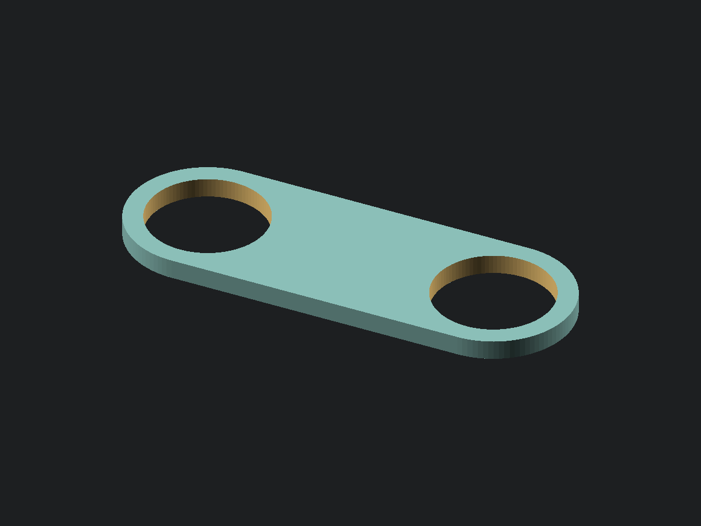
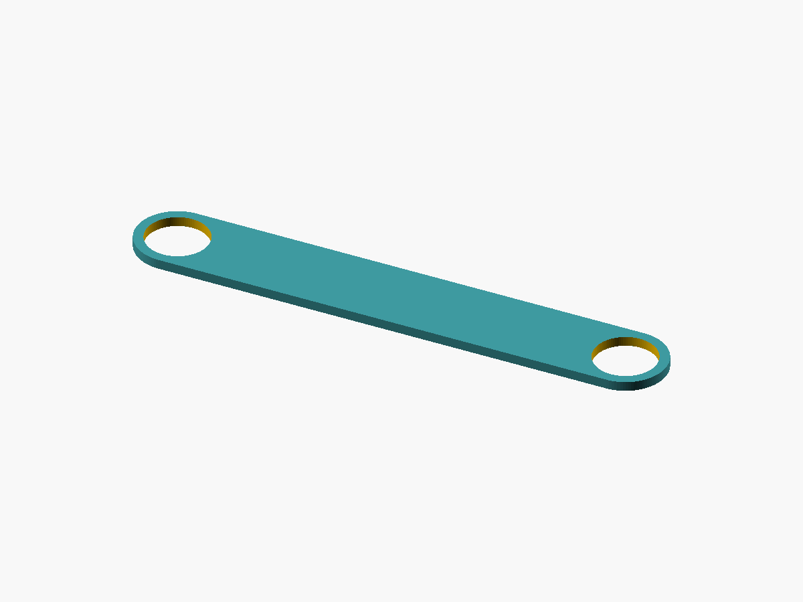
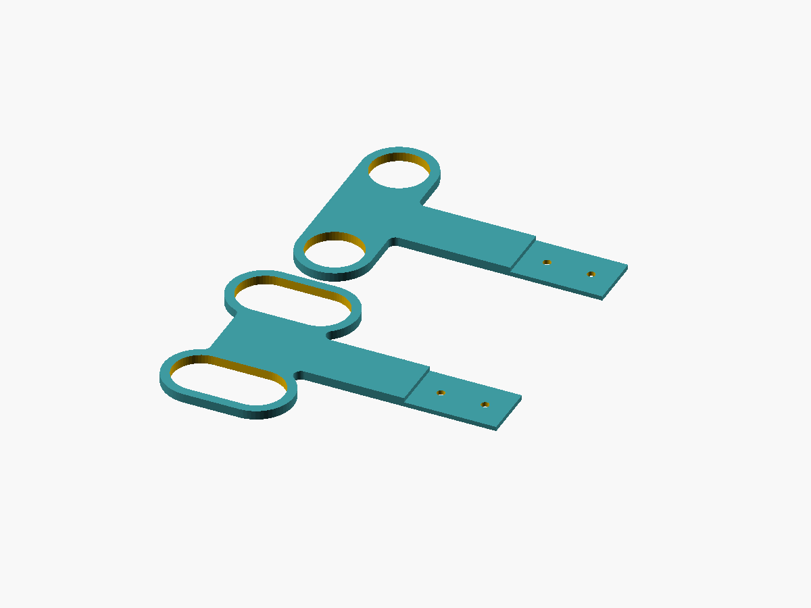
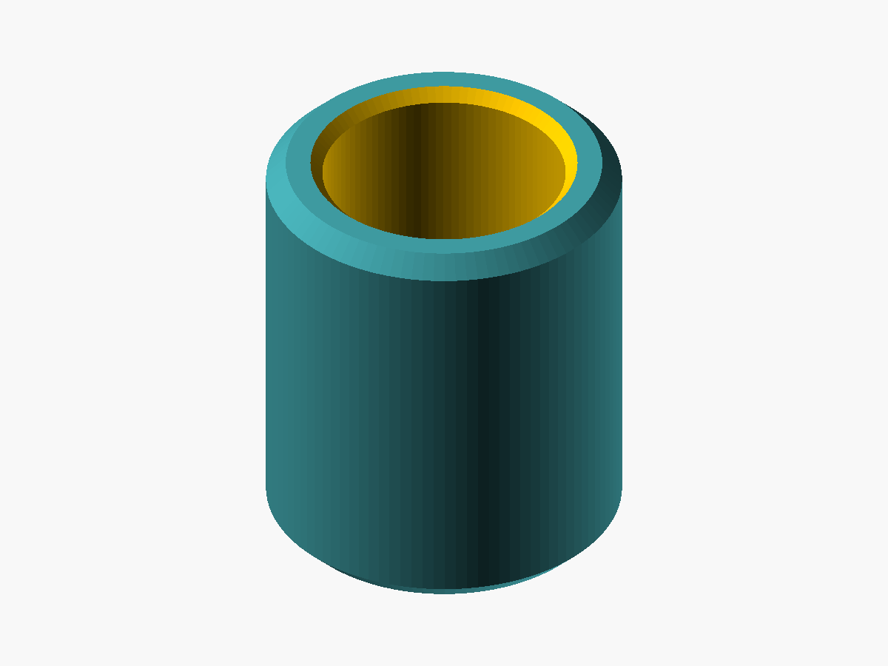

# scad-projects

Parametric OpenSCAD models for 3D-printed parts, mostly one-off fixes for
things around the house. Each project has its own directory, holding a
self-contained `.scad` source with its `.stl` and preview image beside it.
Measured dimensions are variables at the top of the source.

Every model is written to be measured with **calipers**. Parameters are always
things a caliper can physically reach — outside diameters, clear gaps,
edge-to-edge spans — never a center-to-center distance or a dimension inside a
hollow part. Anything like that gets derived instead.

Each measuring table below gives the **caliper size** every parameter needs.
Capacity is the number printed on the tool and it reads nothing past that: 6 in
is 150 mm, 8 in is 200 mm, 12 in is 300 mm. A value within a few millimetres of
a capacity wants the next size up, since the jaws run out before the scale does.

That column is a sanity check as much as a shopping list, and it is worth using
if you don't think natively in millimetres. If a parameter's shipped value would
need a bigger caliper than the one in your hand, then whatever you measured
instead was probably not the dimension being asked for. `post_clear_gap` on the
brace is a gap between the posts rather than a span across them for exactly that
reason — the span is unreachable, so the number that came back was a gap.

## Projects

### Shelf tube coupler

[](shelf_tube_coupler/shelf_tube_coupler.stl)

[View or download STL](shelf_tube_coupler/shelf_tube_coupler.stl) · [OpenSCAD source](shelf_tube_coupler/shelf_tube_coupler.scad)

A rigid collar that ties two adjacent Turn-N-Tube wire shelf units together at
one tube height, replacing zip ties.

The body is a lozenge that slips over both vertical tube posts, holding them a
fixed distance apart. It rests on the shelf below and carries no other features
— what it does is hold the spacing, and it does not hold the units square. The
brace below is what does that.

The coupler **defines** the spacing rather than fitting it. Nothing depends on
how far apart the units happen to sit today, so there is no need to get calipers
between the tubes at all.

**Measuring.** Two measurements, both reachable from outside:

| Parameter | Measure | Caliper |
| --- | --- | --- |
| `tube_od` | Outside jaws on a vertical tube post | 6 in |
| `tube_to_edge` | A tube's outer surface out to the facing edge of its own shelf | 6 in |

Override `left_tube_to_edge` / `right_tube_to_edge` if the two units differ —
a shelf that overhangs further on one side, or a post not set the same distance
in.

**Deciding.** `shelf_gap` is the gap you want between the two units' facing
shelf edges, and the hole spacing follows from it. A gap is worth having:
adjacent units rarely have their shelves at matching heights, and a deliberate
gap keeps that mismatch from reading as a misalignment.

Earlier versions could hang a wall below the collar to fill that gap. It is
gone. It was sold as resisting twist and it does not — see the brace below for
why no arrangement of couplers can — and covering the gap was never worth a
part that also had to fit into it. Nothing replaces it: the gap stays open, and
small items can drop through.

Spacing can drift between levels if the unit tapers, so measure per shelf and
build a variant per size if they differ.

**Printing.** PETG, no supports. Print collar-axis vertical as modelled so the
holes come out round and the tube slides through. Budget two per shelf level —
eight for a five-tier unit, since the top shelf has no tube above it.

### Shelf tube brace

[](shelf_tube_coupler/shelf_tube_brace.stl)

[View or download STL](shelf_tube_coupler/shelf_tube_brace.stl) · [OpenSCAD source](shelf_tube_coupler/shelf_tube_brace.scad)

The third link that makes a coupled pair of units rigid. It shares the coupler's
directory because the two are one system.

Couplers on their own do not hold the units still. Each is pinned at both ends by
a round tube in a round hole, so a pair of them makes a four-bar linkage: one
degree of freedom, whatever their stiffness and however far apart they sit. The
units stay parallel and shear sideways. More couplers do not help, because they
all run the same direction. The freedom is kinematic, which is why the coupler's
old gap-filling wall never closed it — friction was the only tool it had.

Two rigid bodies have three degrees of freedom in plan and each link removes one,
so three links lock them together. The brace is the third: a long flat bar
running diagonally from one unit's **front** post to the other unit's **back**
post, not parallel to the couplers and so removing what they leave behind.

Three links is the entire requirement, so **one brace makes the pair rigid** no
matter how many levels are coupled. Couplers elsewhere in the stack only add
stiffness.

**Measuring.** Three measurements, all within reach of a caliper:

| Parameter | Measure | Caliper |
| --- | --- | --- |
| `tube_od` | Outside jaws on a vertical tube post | 6 in |
| `tube_to_edge` | A tube's outer surface out to the facing edge of its own shelf — must match what the couplers were printed with | 6 in |
| `post_clear_gap` | Inside jaws into the open space between one unit's front and back tube, at any shelf level | 12 in |

`post_clear_gap` is a gap between the posts rather than a span across them
because that is what a caliper can actually reach. The posts are round and the
back one stands against a wall, so there is nothing to hook a tape on, while the
open space between them takes inside jaws. Wiggle for the smallest reading — the
minimum is the gap along the line of centres, and the derivation adds one tube
diameter back on.

It needs a 12 in caliper. At 200.3 mm these shelves are just past where an 8 in
one stops, which is close enough to look measurable and isn't.

It ships as 200, measured off these shelves at 200.3. Measure your own before
printing: the brace has no slot to take up error, and its hole spacing tracks
this number nearly one for one. If the two units differ or do not sit flush at
the front, skip both and set `brace_clear_gap` — the diagonal clear gap measured
straight off the assembled pair, one unit's front tube to the other's back tube,
nearest faces. That one runs longer still, about 212 mm here, so it is a 12 in
caliper too.

`hole_clearance` is deliberately looser here than on the coupler, buying
tolerance for a diagonal that is derived from two measurements rather than read
off the shelves directly, at the cost of about half of it in residual sway.

**Printing.** PETG, no supports, flat on the bed. Flat runs the perimeters along
the load path, where on edge would load the bar across its layers. It is long
enough that placement matters: the echoed bed placement gives the angle and the
square it needs, and turning it 45° costs far less bed than laying it square on.
`bed_size` and `bed_margin` drive an assertion, so a gap too big for the printer
fails the render rather than the print. One per pair of units.

The dogbone below does the same job a different way. Prefer the brace when you
want one part and no hardware, and can measure carefully; prefer the dogbone
when you would rather not have the fit depend on a measurement at all.

### Shelf tube dogbone

[](shelf_tube_dogbone/shelf_tube_dogbone.stl)

[View or download STL](shelf_tube_dogbone/shelf_tube_dogbone.stl) · [OpenSCAD source](shelf_tube_dogbone/shelf_tube_dogbone.scad)

The same rigidity as the brace, reached by gripping all four posts at one level
instead of triangulating. A plate pinned to two posts on a unit cannot rotate
relative to it, so a plate holding two posts on each unit locks the pair
together.

Whole, that plate is about 286 mm long on the measured 200 mm `post_clear_gap`,
past what a 256 mm bed takes; it prints as two halves bolted together at
mid-depth with two M4 bolts, which is what keeps deeper units and smaller beds
printable too. Both halves come out of one source and one `.stl`, because every
dimension they share has to match for them to assemble.

**Four round holes would not go on.** Four holes on four posts dictates the
front-to-back post spacing of both units simultaneously, and two units that
disagree would leave the plate bridging nothing. So the front pair locates and
the back pair are slots running front to back. The round holes fix position, the
slots absorb whatever the units disagree about, and rotation stays fully
constrained because each slot is elongated along the line to its own round hole.
Nothing is left to friction.

That is also why this one tolerates a rough measurement where the brace does
not. `slot_travel` is the whole tolerance budget, 30 mm by default, and the
render echoes the window of `post_clear_gap` it covers.

**Measuring.** The same three as the brace, same caliper sizes:

| Parameter | Measure | Caliper |
| --- | --- | --- |
| `tube_od` | Outside jaws on a vertical tube post | 6 in |
| `tube_to_edge` | A tube's outer surface out to the facing edge of its own shelf — must match what the couplers were printed with | 6 in |
| `post_clear_gap` | Inside jaws into the open space between one unit's front and back tube, at any shelf level | 12 in |

`post_clear_gap` only has to land inside the slot window, so a reading to the
nearest millimetre is plenty — the shipped 200 came off a 200.3 gap.

**Printing.** PETG, no supports. Both halves print flat with the lap face down —
the step down to the lap is a drop in height, not an overhang. The two bodies are
exported clear of each other; let the slicer arrange them. Assemble with two M4
bolts, the front half as printed and **the back half turned over**, so its lap
sits on top of the front's and the finished plate is one thickness throughout.
One dogbone makes a pair of units rigid, whatever the stack height.

### Dowel end cap

[](dowel_endcap/dowel_endcap.stl)

[View or download STL](dowel_endcap/dowel_endcap.stl) · [OpenSCAD source](dowel_endcap/dowel_endcap.scad)

A blind socket that closes off the end of a dowel. A plain cylinder with a
cylindrical recess bored into one end: the dowel pushes in until it bottoms out,
and the remaining material caps it.

One measurement drives the whole part. The outside diameter and the overall
length are not set directly — they fall out of the dowel diameter plus the meat
you want around it, so `wall_meat` thickens the side and the end together.

The recess is never measured. It is a dimension inside a hollow solid, which is
exactly what a caliper cannot reach, so it is bored to the dowel diameter plus a
clearance knob instead. Measure the dowel.

**Measuring.** One measurement:

| Parameter | Measure | Caliper |
| --- | --- | --- |
| `dowel_d` | Outside jaws on the dowel | 6 in |

Take it in two or three places and at a couple of rotations. Wooden dowel is
rarely round and rarely the size on the label, and it is the largest reading that
has to fit.

**Deciding.** `penetration_depth` is how far the dowel goes in; about one and a
half dowel diameters is plenty, and deeper mostly buys resistance to being
levered off sideways. `wall_meat` is the material around it, side and end both.

`dowel_clearance` is the fit. It ships at 0.3 mm for a glue or friction fit —
raise it if the cap will not seat, drop it toward zero for a press. Around 0.6 mm
makes it a slip fit that comes off by hand. `chamfer` breaks both outer rims and
`lead_in` funnels the mouth so the dowel starts square; both eat into the rim
face at the mouth, and the render echoes what is left of it.

**Printing.** PETG or PLA, no supports. Print as modelled, closed end down. That
opens the bore upward so nothing bridges, and lays the one visible end face
against the plate. Flipped, the roof of the bore has to bridge its full width —
it works, but it leaves a rough ceiling for the dowel to bottom out against.

## Working with these

Regenerate every tracked STL and preview image:

```sh
python3 scripts/build.py
```

The default VS Code build task, *Build all objects*, runs the same command. With
an OpenSCAD source active, *Build current object* rebuilds only that object. Set
`OPENSCAD` to the CLI executable path if the script cannot find the installation.

Each model `echo`s its derived dimensions and `assert`s against interferences,
so check the console output against the real part before committing to a print.
Try a variant without editing the file using `-D`:

```sh
/Applications/OpenSCAD.app/Contents/MacOS/OpenSCAD -o /tmp/shelf_tube_coupler.stl -D 'shelf_gap=12' shelf_tube_coupler/shelf_tube_coupler.scad
```

A failed assertion means the numbers don't make a printable part, not that
something is broken — a `post_clear_gap` filled in with a span measured across
the posts instead of between them, for instance, describes a brace two tube
diameters too long, which on these shelves is enough to fail the print-bed check.
Adjust the flagged parameter and re-render.

Source is formatted with [scadformat](https://github.com/hugheaves/scadformat).
It leaves a `.scadbak` beside each file it touches; the *Clean .scadbak backups*
VS Code task clears them.

The OpenSCAD source is canonical. Its generated binary STL and PNG preview are
tracked beside it so GitHub can display the object and offer the mesh for
download. Bambu Studio `.3mf` projects contain slicer preferences, stay ignored,
and are never generated or distributed by this project.

## License

MIT — see [LICENSE](LICENSE).
