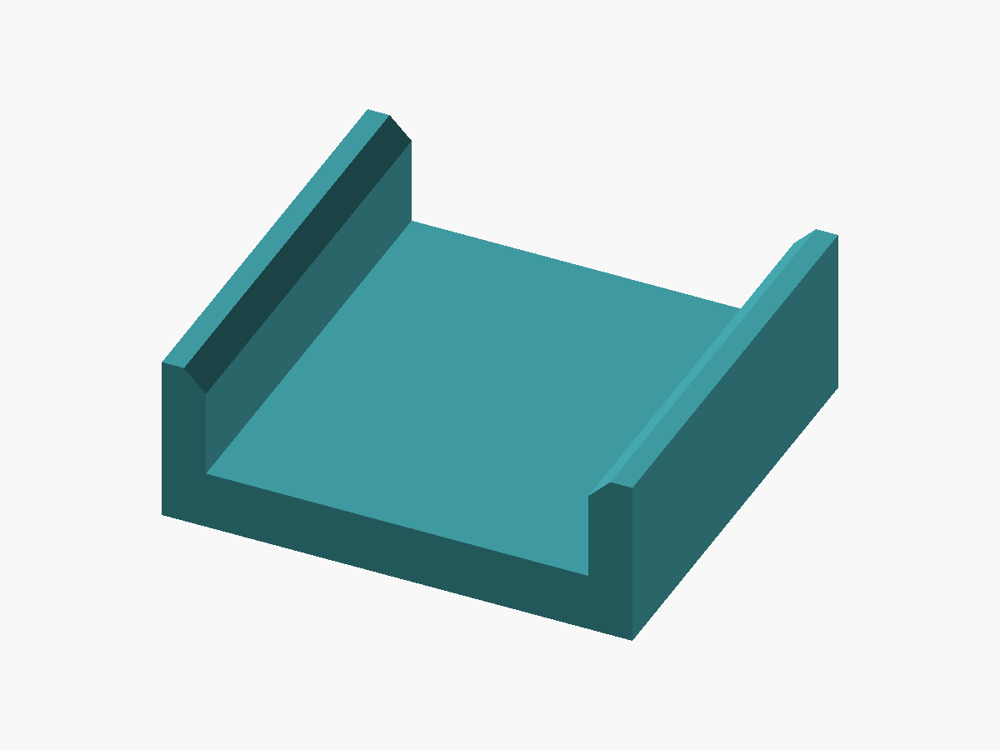

# scad-projects

Parametric OpenSCAD models for 3D-printed parts, mostly one-off fixes for
things around the house. Each project has its own directory, holding a
self-contained `.scad` source per part with its `.stl` and preview image beside
it — one source where the project is one part, and one each where parts are
printed and used together. Measured dimensions are variables at the top of the
source.

Every model is written to be measured with **calipers**. Parameters are always
things a caliper can physically reach — outside diameters, clear gaps,
edge-to-edge spans — never a center-to-center distance or a dimension inside a
hollow part. Anything like that gets derived instead.

Each measuring table below gives the **caliper size** every parameter needs.
Capacity is the number printed on the tool and it reads nothing past that: 6 in
is 150 mm, 8 in is 200 mm, 12 in is 300 mm. A value within a few millimetres of
a capacity wants the next size up, since the jaws run out before the scale does.

That column is a sanity check as much as a shopping list, and it is worth using
if you don't think natively in millimetres. If a parameter's shipped value would
need a bigger caliper than the one in your hand, then whatever you measured
instead was probably not the dimension being asked for. `post_clear_gap` on the
brace is a gap between the posts rather than a span across them for exactly that
reason — the span is unreachable, so the number that came back was a gap.

## Projects

### Shelf tube coupler

[](shelf_tube_coupler/shelf_tube_coupler.stl)

[View or download STL](shelf_tube_coupler/shelf_tube_coupler.stl) · [OpenSCAD source](shelf_tube_coupler/shelf_tube_coupler.scad)

A rigid collar that ties two adjacent Turn-N-Tube wire shelf units together at
one tube height, replacing zip ties.

The body is a lozenge that slips over both vertical tube posts, holding them a
fixed distance apart. It rests on the shelf below and carries no other features
— what it does is hold the spacing, and it does not hold the units square. The
brace below is what does that.

The coupler **defines** the spacing rather than fitting it. Nothing depends on
how far apart the units happen to sit today, so there is no need to get calipers
between the tubes at all.

**Measuring.** Two measurements, both reachable from outside:

| Parameter | Measure | Caliper |
| --- | --- | --- |
| `tube_od` | Outside jaws on a vertical tube post | 6 in |
| `tube_to_edge` | A tube's outer surface out to the facing edge of its own shelf | 6 in |

Override `left_tube_to_edge` / `right_tube_to_edge` if the two units differ —
a shelf that overhangs further on one side, or a post not set the same distance
in.

**Deciding.** `shelf_gap` is the gap you want between the two units' facing
shelf edges, and the hole spacing follows from it. A gap is worth having:
adjacent units rarely have their shelves at matching heights, and a deliberate
gap keeps that mismatch from reading as a misalignment.

Earlier versions could hang a wall below the collar to fill that gap. It is
gone. It was sold as resisting twist and it does not — see the brace below for
why no arrangement of couplers can — and covering the gap was never worth a
part that also had to fit into it. Nothing replaces it: the gap stays open, and
small items can drop through.

Spacing can drift between levels if the unit tapers, so measure per shelf and
build a variant per size if they differ.

**Printing.** PETG, no supports. Print collar-axis vertical as modelled so the
holes come out round and the tube slides through. Budget two per shelf level —
eight for a five-tier unit, since the top shelf has no tube above it.

### Shelf tube brace

[](shelf_tube_coupler/shelf_tube_brace.stl)

[View or download STL](shelf_tube_coupler/shelf_tube_brace.stl) · [OpenSCAD source](shelf_tube_coupler/shelf_tube_brace.scad)

The third link that makes a coupled pair of units rigid. It shares the coupler's
directory because the two are one system.

Couplers on their own do not hold the units still. Each is pinned at both ends by
a round tube in a round hole, so a pair of them makes a four-bar linkage: one
degree of freedom, whatever their stiffness and however far apart they sit. The
units stay parallel and shear sideways. More couplers do not help, because they
all run the same direction. The freedom is kinematic, which is why the coupler's
old gap-filling wall never closed it — friction was the only tool it had.

Two rigid bodies have three degrees of freedom in plan and each link removes one,
so three links lock them together. The brace is the third: a long flat bar
running diagonally from one unit's **front** post to the other unit's **back**
post, not parallel to the couplers and so removing what they leave behind.

Three links is the entire requirement, so **one brace makes the pair rigid** no
matter how many levels are coupled. Couplers elsewhere in the stack only add
stiffness.

**Measuring.** Three measurements, all within reach of a caliper:

| Parameter | Measure | Caliper |
| --- | --- | --- |
| `tube_od` | Outside jaws on a vertical tube post | 6 in |
| `tube_to_edge` | A tube's outer surface out to the facing edge of its own shelf — must match what the couplers were printed with | 6 in |
| `post_clear_gap` | Inside jaws into the open space between one unit's front and back tube, at any shelf level | 12 in |

`post_clear_gap` is a gap between the posts rather than a span across them
because that is what a caliper can actually reach. The posts are round and the
back one stands against a wall, so there is nothing to hook a tape on, while the
open space between them takes inside jaws. Wiggle for the smallest reading — the
minimum is the gap along the line of centres, and the derivation adds one tube
diameter back on.

It needs a 12 in caliper. At 200.3 mm these shelves are just past where an 8 in
one stops, which is close enough to look measurable and isn't.

It ships as 200, measured off these shelves at 200.3. Measure your own before
printing: the brace has no slot to take up error, and its hole spacing tracks
this number nearly one for one. If the two units differ or do not sit flush at
the front, skip both and set `brace_clear_gap` — the diagonal clear gap measured
straight off the assembled pair, one unit's front tube to the other's back tube,
nearest faces. That one runs longer still, about 212 mm here, so it is a 12 in
caliper too.

`hole_clearance` is deliberately looser here than on the coupler, buying
tolerance for a diagonal that is derived from two measurements rather than read
off the shelves directly, at the cost of about half of it in residual sway.

**Printing.** PETG, no supports, flat on the bed. Flat runs the perimeters along
the load path, where on edge would load the bar across its layers. It is long
enough that placement matters: the echoed bed placement gives the angle and the
square it needs, and turning it 45° costs far less bed than laying it square on.
`bed_size` and the per-edge `bed_margin` drive an assertion, so a gap too big for
the printer fails the render rather than the print. One per pair of units.

The dogbone below does the same job a different way. Prefer the brace when you
want one part and no hardware, and can measure carefully; prefer the dogbone
when you would rather not have the fit depend on a measurement at all.

### Shelf tube dogbone

[](shelf_tube_dogbone/shelf_tube_dogbone.stl)

[View or download STL](shelf_tube_dogbone/shelf_tube_dogbone.stl) · [OpenSCAD source](shelf_tube_dogbone/shelf_tube_dogbone.scad)

The same rigidity as the brace, reached by gripping all four posts at one level
instead of triangulating. A plate pinned to two posts on a unit cannot rotate
relative to it, so a plate holding two posts on each unit locks the pair
together.

Whole, that plate is about 286 mm long on the measured 200 mm `post_clear_gap`,
past what a 256 mm bed takes; it prints as two halves bolted together at
mid-depth with two M4 bolts, which is what keeps deeper units and smaller beds
printable too. Both halves come out of one source and one `.stl`, because every
dimension they share has to match for them to assemble.

**Four round holes would not go on.** Four holes on four posts dictates the
front-to-back post spacing of both units simultaneously, and two units that
disagree would leave the plate bridging nothing. So the front pair locates and
the back pair are slots running front to back. The round holes fix position, the
slots absorb whatever the units disagree about, and rotation stays fully
constrained because each slot is elongated along the line to its own round hole.
Nothing is left to friction.

That is also why this one tolerates a rough measurement where the brace does
not. `slot_travel` is the whole tolerance budget, 30 mm by default, and the
render echoes the window of `post_clear_gap` it covers.

**Measuring.** The same three as the brace, same caliper sizes:

| Parameter | Measure | Caliper |
| --- | --- | --- |
| `tube_od` | Outside jaws on a vertical tube post | 6 in |
| `tube_to_edge` | A tube's outer surface out to the facing edge of its own shelf — must match what the couplers were printed with | 6 in |
| `post_clear_gap` | Inside jaws into the open space between one unit's front and back tube, at any shelf level | 12 in |

`post_clear_gap` only has to land inside the slot window, so a reading to the
nearest millimetre is plenty — the shipped 200 came off a 200.3 gap.

**Printing.** PETG, no supports. Both halves print flat with the lap face down —
the step down to the lap is a drop in height, not an overhang. The two bodies are
exported clear of each other; let the slicer arrange them. Assemble with two M4
bolts, the front half as printed and **the back half turned over**, so its lap
sits on top of the front's and the finished plate is one thickness throughout.
`bed_size` and the per-edge `bed_margin` reject a half that cannot fit. One
dogbone makes a pair of units rigid, whatever the stack height.

### Dowel end cap

[](dowel_endcap/dowel_endcap.stl)

[View or download STL](dowel_endcap/dowel_endcap.stl) · [OpenSCAD source](dowel_endcap/dowel_endcap.scad)

A blind socket that closes off the end of a dowel. A plain cylinder with a
cylindrical recess bored into one end: the dowel pushes in until it bottoms out,
and the remaining material caps it.

One measurement drives the whole part. The outside diameter and the overall
length are not set directly — they fall out of the dowel diameter plus the meat
you want around it, so `wall_meat` thickens the side and the end together.

The recess is never measured. It is a dimension inside a hollow solid, which is
exactly what a caliper cannot reach, so it is bored to the dowel diameter plus a
clearance knob instead. Measure the dowel.

Set `screw_hole = true` and a countersunk hole runs through the closed end, so a
flat-head screw driven into the end grain holds the cap on rather than the fit or
a glue line. It ships off, and the plain cap is what the STL above is.

**Measuring.** One measurement, plus two more if you are fitting a screw:

| Parameter | Measure | Caliper |
| --- | --- | --- |
| `dowel_d` | Outside jaws on the dowel | 6 in |
| `screw_shank_d` | Outside jaws on the threaded shank | 6 in |
| `screw_head_d` | Outside jaws across the top face of the head | 6 in |

Take the dowel in two or three places and at a couple of rotations. Wooden dowel
is rarely round and rarely the size on the label, and it is the largest reading
that has to fit. The two screw measurements are ignored unless `screw_hole` is
on; the head is the one that decides how deep the countersink goes.

**Deciding.** `penetration_depth` is how far the dowel goes in; about one and a
half dowel diameters is plenty, and deeper mostly buys resistance to being
levered off sideways. `wall_meat` is the material around it, side and end both —
and it is also what the countersink has to fit inside, so a big screw head in a
thin end wall is what the asserts catch.

`dowel_clearance` is the fit. It ships at 0.3 mm for a glue or friction fit —
raise it if the cap will not seat, drop it toward zero for a press. Around 0.6 mm
makes it a slip fit that comes off by hand. `chamfer` breaks both outer rims and
`lead_in` funnels the mouth so the dowel starts square; both eat into the rim
face at the mouth, and the render echoes what is left of it.

`screw_clearance` opens both bored screw diameters together, so the shank slips
through instead of threading into the plastic and the head seats without binding.
The countersink itself has no angle knob: its depth is half the difference of the
two bored diameters, which makes it the 90° included angle flat heads are ground
to, whatever screw it is cut for. The render echoes the mouth diameter, the depth,
the straight hole left under it and the ring of end face left around it.

**Printing.** PETG or PLA, no supports. Print as modelled, closed end down. That
opens the bore upward so nothing bridges, and lays the one visible end face
against the plate. Flipped, the roof of the bore has to bridge its full width —
it works, but it leaves a rough ceiling for the dowel to bottom out against.

The countersink opens at the plate and closes in at 45°, so it is self-supporting
exactly like the chamfers. It does make the first layer a ring rather than a
disc; the end face is wide enough that there is plenty of adhesion left.

### Zip tie corner blocks

[](zip_tie_corner_blocks/zip_tie_corner_blocks.stl)

[View or download STL](zip_tie_corner_blocks/zip_tie_corner_blocks.stl) · [OpenSCAD source](zip_tie_corner_blocks/zip_tie_corner_blocks.scad)

A corner shoe that carries a zip tie around a square object instead of letting
the tie grab the corner. Truckers put something like it under a ratchet strap;
this one is proportioned for a nylon tie rather than a woven strap, and it is
one piece, so there are no indexing pegs to lose at this scale.

A tie pulled around a square touches it at four points. The tie wants to be a
circle, the object is a square, and what is left is a squircle with the square
inscribed in it — all the tension on four corner tips, with the tie itself doing
the digging.

Each block is a thick right angle. Two flat inner faces bear on the object's two
flats, and a curved channel runs through the block from one leg's end face to
the other's. The tie still takes the curve it wants; it just takes it inside the
channel, and the block turns that curve into pressure spread along the flats.
Four blocks make the tie a rounded square instead of a squircle. They are
identical and have no handedness — the block is symmetric about its own
diagonal, so the same print goes on all four corners, turned 90° each time.

A circular relief is knocked out of the inner corner so the block never bears on
the corner itself. A printed internal corner is never sharp, and a real corner
may carry a weld, a seam, an extrusion line, a fold of tape or a dent. Relieved,
the block sits on the two flats and ignores all of that.

**A gentler bend passes closer to the corner.** This is the one thing about the
part that runs backwards to intuition, and it is what sets how thick the block
comes out. The tie has to leave each block running parallel to the flat it came
off, or the runs between blocks would not lie straight, so the corner arc is
tangent to two lines standing off the flats. Grow that arc and it stops hugging
the corner and starts cutting the diagonal across it — at a radius of about 3.4
times the standoff it would pass through the corner point itself. The block buys
room for a bigger radius the only way it can: by standing the whole channel
further off the flats. So `bend_radius` sets the thickness, and `face_offset` —
the standoff, and the height the tie rides above each flat between blocks — is
echoed rather than chosen. Winding `bend_radius` down to the echoed
`min_bend_radius` gives the most compact block there is, with the arc concentric
with the corner and the standoff no more than the relief plus the web.

**Measuring.** Two measurements, both on the tie itself:

| Parameter | Measure | Caliper |
| --- | --- | --- |
| `tie_width` | Outside jaws across the flat of the strap | 6 in |
| `tie_thickness` | Outside jaws on the edge of the strap, over the teeth | 6 in |

Measure the plain strap well away from the head, and take the thickness across
the ratchet teeth rather than between them — the teeth are what has to clear the
channel. Nominal 4.8 mm ties run anywhere from 1.1 to 1.6 mm thick depending on
how heavy the tie is, so measure the one in your hand instead of trusting the
packet.

The object is never measured. Nothing in the part depends on how big it is, only
on its corner being square, so the blocks fit a 40 mm post and a 400 mm crate the
same way. The render echoes the two numbers that do depend on it: the shortest
flat two blocks fit on, which is twice `leg_length`, and the tie loop needed,
which is four times the object's side plus a fixed allowance for the four arcs.
Add room for the tie's head on whichever flat it lands on.

**Deciding.** `bend_radius` is the knob the part is built around — gentler bend,
thicker block, as above. `leg_length` is how far each leg reaches along its flat,
and everything past the corner relief is bearing surface, so it is the
load-spreading dimension; it also sets the shortest object the blocks fit.
`corner_relief_d` has to swallow the printed fillet in the block's own internal
corner plus whatever the object's corner is carrying — 4 mm is plenty for a clean
extrusion or a planed edge, and it opens up for a weld bead.

`corner_web` is the material between that relief and the channel, and it is not a
skin: a tensioned tie takes the shortest path through the channel, which means it
pulls against the wall on the corner side. That web is the load path from the tie
into the block, and from there into the two flats.

`tie_clearance` opens both channel dimensions together. It ships at 0.6 mm, which
is looser than a part like this would normally get, because the tie has to be
pushed through a 90° bend rather than dropped into a slot.

**Printing.** PETG, PLA or ASA, no supports. Print as modelled, one flat face
down and the corner edge vertical. That runs the layers across the block rather
than along the channel, so the tie's pull sits in the layer plane instead of
across the layer lines. Three or four perimeters and 30% infill or more — the
corner web is the piece that is loaded.

The channel is a tunnel and not an open groove, so the tie cannot fall out while
everything is still slack. Its roof is a gable rising the full width of the slot
against half that in run, which puts both faces at 26.6° from vertical, so
nothing bridges and no value of `tie_thickness` can change that. Every other
surface in the part is vertical, on the plate, or facing up. The bottom edge of
each inner face is chamfered at 45° so an elephant foot cannot rock the block off
the flats.

The source emits one block; print four. Thread the tail through all four before
feeding it into the head — the head does not fit through the channel and is not
meant to, and it sits on a flat between two blocks.

#### The TPU sleeve

[](zip_tie_corner_blocks/zip_tie_corner_block_sleeves.stl)

[View or download STL](zip_tie_corner_blocks/zip_tie_corner_block_sleeves.stl) · [OpenSCAD source](zip_tie_corner_blocks/zip_tie_corner_block_sleeves.scad)

A soft liner that goes between one leg of a block and the flat it bears on. The
block is rigid and everything it presses against is painted, powder-coated or
anodized, so the sleeve is the layer that grips, that spreads the tie's load over
a surface which is never quite flat, and that takes the scuffing instead of the
finish underneath. It is optional — the blocks work bare.

It has three sides. The wide one is the pad, and it is the whole working surface:
it lies on the block's inner face and bears on the object. The other two are lips
that fold over the block's top and bottom faces.

The lips are not the fastening — glue is. What they do is stop the sleeve sliding
while the glue is wet and square it up on the face by themselves, so there is
nothing to line up by eye. The channel is printed a shade narrow across and
snapped onto the block, and the glue cures with everything already where it
belongs.

**One leg, one sleeve.** A block has two inner faces, so it takes two, and a set
of four blocks takes eight. They are all the same part: the channel is symmetric
top to bottom and uniform end to end, so it has no handedness and no right way
up.

**Matching the block.** The sleeve has to come out the same size as the block it
wraps, and every source here is self-contained, so it carries its own copies of
the block's `tie_clearance`, `deck`, `leg_length`, `corner_relief_d`,
`bend_radius`, `corner_web`, `outer_wall` and `foot_chamfer`, plus the same two
tie measurements. None of them is a free choice — change one and change it in
both files. Both sources echo the block height and the leg thickness, so the
quickest check that they are in step is to render the two and compare.

**Deciding.** `pad_thickness` is all of the cushion and all of the grip, and it
is also how far the block ends up standing off the flat, so the tie rides that
much higher — the sleeve echoes the standoff the assembled joint actually has. It
has to stay under the corner relief radius, or the two sleeves on one block meet
at the corner. `lip_reach` and `lip_thickness` size the lips: far enough over the
face to hold the sleeve square, not so far as to reach past the back of the leg,
and thin enough to spring over the block without tearing off it.

`block_pinch` is subtracted from the block height, so the channel is narrow by
that much and holds itself on before it is glued. `lip_lead_in` tapers the lip
tips so the sleeve can start out of square and still snap on.

**Printing.** TPU, no supports. Print as modelled, pad down. Nothing in this part
hangs at all — every face is vertical, on the plate, or facing up, the two
lead-in bevels included, since they taper the tips at 45° and so point upward
rather than down. Pad down also puts the plate's finish on the face that bears on
the object and leaves the printed top surface as the glue face, which is the way
round that suits both.

Three perimeters; at this size the lips are perimeters the whole way through,
which is what makes them springy rather than crumbly. Cyanoacrylate or contact
cement — TPU takes both, and the rigid filament under it is what decides. The
block's foot chamfer leaves a groove along one edge between the pad and the
block; that is a glue reservoir, not a gap to close.

### Foot with post

[](foot_with_post/foot_with_post.stl)

[View or download STL](foot_with_post/foot_with_post.stl) · [OpenSCAD source](foot_with_post/foot_with_post.scad)

A TPU foot that plugs into a socket already in the bottom of whatever it holds
up. Two stacked cylinders: the lower, wider one stands on the floor and lifts
the object by its own height, and the upper, narrower one is a plug for the
hole.

The step between them is the shoulder, and that is what the object rests on.
The post carries nothing down the axis — it is there so the foot cannot walk out
from under the object or drop off when the thing is picked up. In TPU the foot
also grips the floor and damps whatever the object does.

Both rims are chamfered, for opposite reasons. The bottom one is room for the
first layer to spread into: TPU squashes more than a rigid filament does, and a
foot is the one part where a flared elephant foot is guaranteed to end up as the
surface bearing on the floor. The top one is a lead-in, because a soft post
pushed at a hole it is not quite lined up with folds over instead of entering.

**Measuring.** Two measurements, both on the socket, which opens at the bottom
face where an ordinary caliper reaches it:

| Parameter | Measure | Caliper |
| --- | --- | --- |
| `socket_d` | Inside jaws opened against the wall of the hole | 6 in |
| `socket_depth` | Depth rod down the hole until it stops | 6 in |

Take the diameter at a couple of rotations. A molded socket is often slightly
oval, and here it is the *smallest* reading that matters, since that is what the
post has to pass. The depth is only used to check that the post is not longer
than the hole.

The post itself is never measured. It is the socket plus `post_interference`,
because TPU is fitted by squeezing it rather than by clearing it — the knob is
*added* to the socket diameter and ships at 0.2 mm. Raise it for more grip, drop
it toward zero if the post will not start, and go negative only if the socket is
soft as well.

**Deciding.** `foot_d` and `foot_h` are the foot: how wide the contact patch and
the shoulder are, and how far the object is lifted. `post_h` is how far the post
reaches into the socket — it grips over its whole length, so most of the socket
is worth using, and the assert is what keeps it from bottoming out before the
shoulder seats. The render echoes the overall height, the shoulder ring, the
contact patch left after the chamfer and the air left under the post.

`foot_chamfer` and `post_chamfer` size the two rims. Neither has an angle: each
is written with its radial run equal to its rise, so it stays at 45° whatever
value it is given.

**Printing.** TPU, no supports. Print as modelled, foot down. Nothing in the part
hangs — the top chamfer closes inward, the shoulder faces up, and the only
downward face is the foot's bottom chamfer at 45°, in the first millimetre or two
off the plate.

Slow it down; TPU at speed under-extrudes on the small circumference of the post,
and the post is the part that has to hold. Infill is the squish — a foot at 15%
gives under weight and a solid one barely does, and neither is wrong, since that
is what the foot is for. Three perimeters either way, so the post has walls in it
rather than infill. Print the set together and they come out the same height;
printed one at a time they will not, quite.

## Working with these

Regenerate every tracked STL and preview image:

```sh
python3 scripts/build.py
```

The default VS Code build task, *Build all objects*, runs the same command. With
an OpenSCAD source active, *Build current object* rebuilds only that object. Set
`OPENSCAD` to the CLI executable path if the script cannot find the installation.

Each model `echo`s its derived dimensions and `assert`s against interferences,
so check the console output against the real part before committing to a print.

Every part is designed to print without supports, which is a constraint on the
geometry rather than a slicer setting. The build checks each object it exports
and warns about any surface hanging past 45° from vertical, naming the angle and
the height it occurs at. It is only a warning — the export is still written, so
the warning is there to be read rather than to stop anything.

To check a mesh on its own, or to see the shallow surfaces the build stays quiet
about:

```sh
python3 scripts/overhangs.py dowel_endcap/dowel_endcap.stl
```

Chamfers and lead-ins are written with their run equal to their rise, so they sit
at exactly 45° whatever value the knob is given.
Try a variant without editing the file using `-D`:

```sh
/Applications/OpenSCAD.app/Contents/MacOS/OpenSCAD -o /tmp/shelf_tube_coupler.stl -D 'shelf_gap=12' shelf_tube_coupler/shelf_tube_coupler.scad
```

A failed assertion means the numbers don't make a printable part, not that
something is broken — a `post_clear_gap` filled in with a span measured across
the posts instead of between them, for instance, describes a brace two tube
diameters too long, which on these shelves is enough to fail the print-bed check.
Adjust the flagged parameter and re-render.

Source is formatted with [scadformat](https://github.com/hugheaves/scadformat).
It leaves a `.scadbak` beside each file it touches; the *Clean .scadbak backups*
VS Code task clears them.

The OpenSCAD source is canonical. Its generated binary STL and PNG preview are
tracked beside it so GitHub can display the object and offer the mesh for
download. Bambu Studio `.3mf` projects contain slicer preferences, stay ignored,
and are never generated or distributed by this project.

## License

MIT — see [LICENSE](LICENSE).
