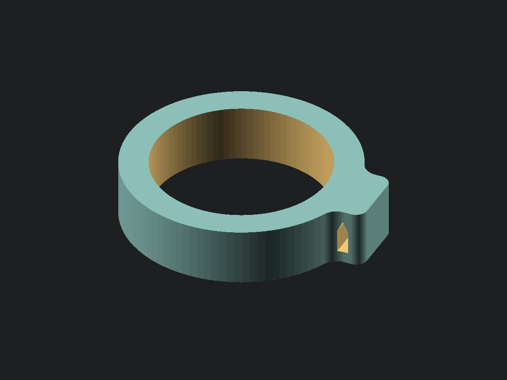
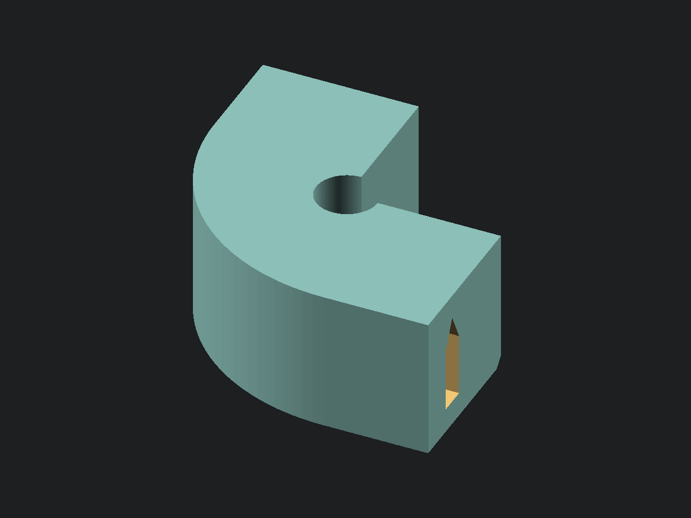
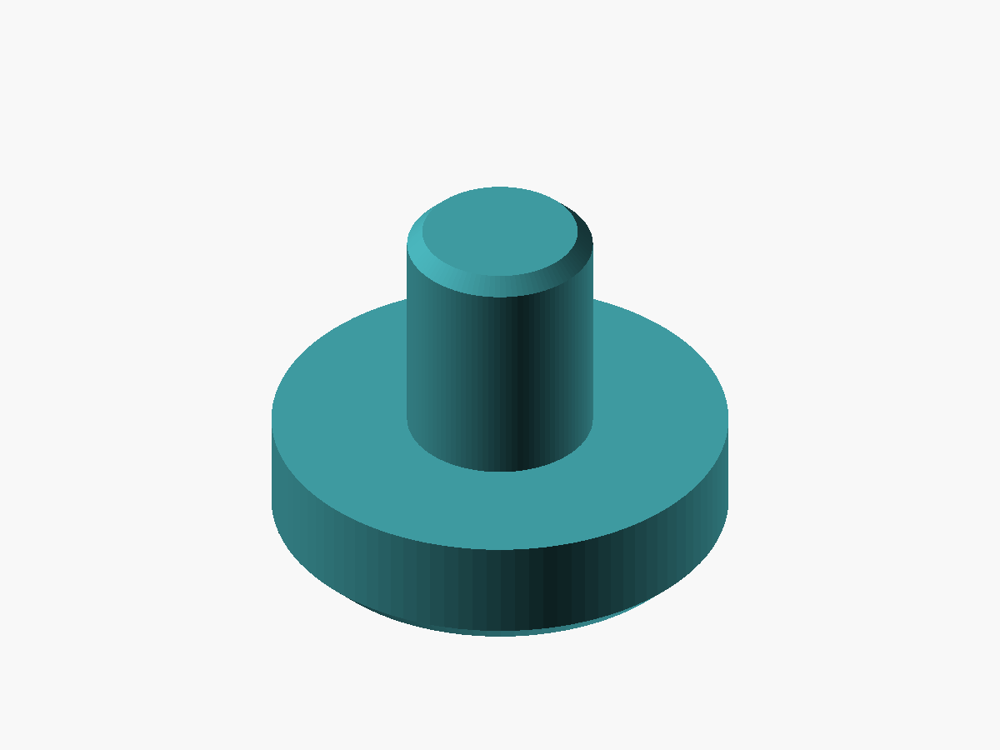
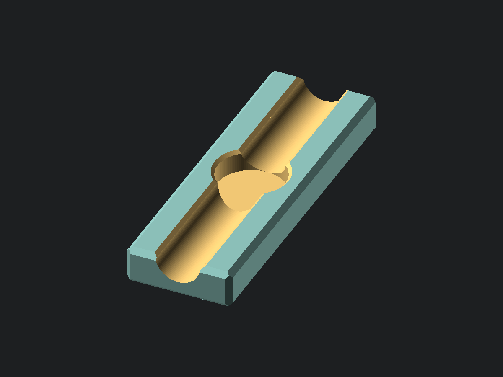

# scad-projects

Parametric OpenSCAD models for 3D-printed parts, mostly one-off fixes for
things around the house. Each project has its own directory, holding a
self-contained `.scad` source per part with its `.stl`, preview image and
`README.md` beside it — one source where the project is one part, and one each where parts are
printed and used together. Measured dimensions are variables at the top of the
source.

Every model is written to be measured with **calipers**. Parameters are always
things a caliper can physically reach — outside diameters, clear gaps,
edge-to-edge spans — never a center-to-center distance or a dimension inside a
hollow part. Anything like that gets derived instead.

Each project's README gives a measuring table naming the **caliper size** every
parameter needs.
Capacity is the number printed on the tool and it reads nothing past that: 6 in
is 150 mm, 8 in is 200 mm, 12 in is 300 mm. A value within a few millimetres of
a capacity wants the next size up, since the jaws run out before the scale does.

That column is a sanity check as much as a shopping list, and it is worth using
if you don't think natively in millimetres. If a parameter's shipped value would
need a bigger caliper than the one in your hand, then whatever you measured
instead was probably not the dimension being asked for. `post_clear_gap` on the
brace is a gap between the posts rather than a span across them for exactly that
reason — the span is unreachable, so the number that came back was a gap.

## Where the documentation lives

Three levels, chosen by how long a fact outlives the thing it describes.

- **This file is a catalogue.** One card per project: what it is, and links to
  its mesh and source. It stays scannable as parts accumulate.
- **A `README.md` beside each part** carries the full treatment — measuring
  table, tuning guidance, print notes — and GitHub renders it when you browse
  into the directory. Every project has one.
- **A top-level subject file** holds knowledge spanning parts that outlives any
  of them. There is one so far: **[OPENGRID.md](OPENGRID.md)**, covering the
  openGrid system — tile and snap thicknesses, the full snap profile as a table,
  print-orientation rules, licensing across a mixed-licence ecosystem, how to
  verify a reimplementation against the reference generator, and the assumptions
  that looked right and were not.

## Projects

### Shelf tube coupler and brace

[](shelf_tube_coupler/shelf_tube_coupler.stl)

[Documentation](shelf_tube_coupler/README.md) · coupler: [STL](shelf_tube_coupler/shelf_tube_coupler.stl) · [source](shelf_tube_coupler/shelf_tube_coupler.scad) · brace: [STL](shelf_tube_coupler/shelf_tube_brace.stl) · [source](shelf_tube_coupler/shelf_tube_brace.scad)

Two parts that tie a pair of adjacent Turn-N-Tube wire shelf units into one rigid
assembly, replacing zip ties. The coupler is a collar holding two posts a fixed
distance apart; the brace is the diagonal third link that stops the pair
shearing. Couplers alone leave a four-bar linkage no number of them can close,
so one brace makes the pair rigid however many levels are coupled.

### Shelf tube dogbone

[](shelf_tube_dogbone/shelf_tube_dogbone.stl)

[Documentation](shelf_tube_dogbone/README.md) · [STL](shelf_tube_dogbone/shelf_tube_dogbone.stl) · [source](shelf_tube_dogbone/shelf_tube_dogbone.scad)

The same rigidity as the brace, reached by gripping all four posts at one level
instead of triangulating. It splits into two halves to fit the bed and carries a
30 mm tolerance window, so the fit does not depend on getting a hard measurement
right. Reach for it instead of the brace when you would rather not measure.

### Shelf tube wall anchor

[](shelf_tube_anchor/shelf_tube_anchor.stl)

[Documentation](shelf_tube_anchor/README.md) · [STL](shelf_tube_anchor/shelf_tube_anchor.stl) · [source](shelf_tube_anchor/shelf_tube_anchor.scad)

A collar that slips over one vertical post and carries a lug with a zip tie
channel bored through it, so the tie holding the post back to the wall never has
to go around the post. The channel is a U-turn rather than a straight bore, which
puts the tie's pull on an island of material across a half turn instead of on two
corner tips.

### Dowel end cap

[](dowel_endcap/dowel_endcap.stl)

[Documentation](dowel_endcap/README.md) · [STL](dowel_endcap/dowel_endcap.stl) · [source](dowel_endcap/dowel_endcap.scad)

A blind socket that closes off the end of a dowel: a plain cylinder with a
cylindrical recess bored into one end, so the dowel pushes in until it bottoms
out and the remaining material caps it.

### Zip tie corner blocks and sleeves

[](zip_tie_corner_blocks/zip_tie_corner_blocks.stl)

[Documentation](zip_tie_corner_blocks/README.md) · blocks: [STL](zip_tie_corner_blocks/zip_tie_corner_blocks.stl) · [source](zip_tie_corner_blocks/zip_tie_corner_blocks.scad) · sleeves: [STL](zip_tie_corner_blocks/zip_tie_corner_block_sleeves.stl) · [source](zip_tie_corner_blocks/zip_tie_corner_block_sleeves.scad)

A corner shoe that carries a zip tie around a square object instead of letting the
tie grab the corner, with an optional slip-on sleeve to protect the finish
underneath. Proportioned for a nylon tie rather than the woven strap the same
idea usually serves.

### Foot with post

[](foot_with_post/foot_with_post.stl)

[Documentation](foot_with_post/README.md) · [STL](foot_with_post/foot_with_post.stl) · [source](foot_with_post/foot_with_post.scad)

A TPU foot that plugs into a socket already in the bottom of whatever it holds up.
Two stacked cylinders: the lower and wider one stands on the floor and lifts the
object by its own height, the upper and narrower one is the plug.

### Pencil rest

[](pencil_rest/pencil_rest.stl)

[Documentation](pencil_rest/README.md) · [STL](pencil_rest/pencil_rest.stl) · [source](pencil_rest/pencil_rest.scad)

A block with a cradle down its top, to park a pencil on the desk instead of
letting it roll off. The block's height falls out of the cradle rather than the
cradle being fitted into a height, and a notch cut clean through the middle is
what makes the pencil possible to pick up again.

### openGrid magnet snaps

[](opengrid_magnet_snap/opengrid_magnet_snap_back.stl)

[Documentation](opengrid_magnet_snap/README.md) · back: [STL](opengrid_magnet_snap/opengrid_magnet_snap_back.stl) · [source](opengrid_magnet_snap/opengrid_magnet_snap_back.scad) · front: [STL](opengrid_magnet_snap/opengrid_magnet_snap_front.stl) · [source](opengrid_magnet_snap/opengrid_magnet_snap_front.scad)

Two full-thickness openGrid snaps carrying a disc magnet instead of a connector,
differing only in which face the magnet is on. Drop one into a cell and that cell
becomes a magnetic pad, so a board hangs off steel with no fastener and no
adhesive. The back face variant is the one that sticks a tile to steel; the front
face variant presents its magnet outward instead.

The snap profile is not original work — it is the openGrid standard, rebuilt from
mitufy's generator under CC BY 4.0 and checked against it by boolean difference.
See [OPENGRID.md](OPENGRID.md) for the system as a whole.

### openGrid mount for a triple 4-tier bookshelf

[Design notes and measurements needed](triple_4_tier_book_shelf_opengrid_mount/TODO.md)

Not yet modelled. The directory holds the design decision — hook the frame's
rungs with vertical rails rather than taping to the posts, letting the rails
adapt between the shelf's arbitrary post spacing and openGrid's 28 mm pitch —
and the list of measurements still to take.

## Working with these

Regenerate every tracked STL and preview image:

```sh
python3 scripts/build.py
```

The default VS Code build task, *Build all objects*, runs the same command. With
an OpenSCAD source active, *Build current object* rebuilds only that object. Set
`OPENSCAD` to the CLI executable path if the script cannot find the installation.

Each model `echo`s its derived dimensions and `assert`s against interferences,
so check the console output against the real part before committing to a print.

Every part is designed to print without supports, which is a constraint on the
geometry rather than a slicer setting. The build checks each object it exports
and warns about any surface hanging past 45° from vertical, naming the angle and
the height it occurs at. It is only a warning — the export is still written, so
the warning is there to be read rather than to stop anything.

To check a mesh on its own, or to see the shallow surfaces the build stays quiet
about:

```sh
python3 scripts/overhangs.py dowel_endcap/dowel_endcap.stl
```

Chamfers and lead-ins are written with their run equal to their rise, so they sit
at exactly 45° whatever value the knob is given.
Try a variant without editing the file using `-D`:

```sh
/Applications/OpenSCAD.app/Contents/MacOS/OpenSCAD -o /tmp/shelf_tube_coupler.stl -D 'shelf_gap=12' shelf_tube_coupler/shelf_tube_coupler.scad
```

A failed assertion means the numbers don't make a printable part, not that
something is broken — a `post_clear_gap` filled in with a span measured across
the posts instead of between them, for instance, describes a brace two tube
diameters too long, which on these shelves is enough to fail the print-bed check.
Adjust the flagged parameter and re-render.

Source is formatted with [scadformat](https://github.com/hugheaves/scadformat).
It leaves a `.scadbak` beside each file it touches; the *Clean .scadbak backups*
VS Code task clears them.

The OpenSCAD source is canonical. Its generated binary STL and PNG preview are
tracked beside it so GitHub can display the object and offer the mesh for
download. Bambu Studio `.3mf` projects contain slicer preferences, stay ignored,
and are never generated or distributed by this project.

## License

Two licences, one for each kind of work in here. See [LICENSE](LICENSE) for the
boundary and the reasoning, and [LICENSES/](LICENSES/) for the full texts.

| | |
| --- | --- |
| Printable objects and documentation — `.scad`, `.stl`, `.png`, every Markdown document, and other design artifacts | **CC BY 4.0** |
| Software and repository tooling — `scripts/`, `tests/`, `.vscode/`, and repository configuration | **MIT** |

Those examples are inclusive rather than exhaustive. A per-file SPDX identifier
controls whenever one is present.

The openGrid snap profile in [opengrid_magnet_snap](opengrid_magnet_snap/) is not
original to this repository. It derives from openGrid by David D
([opengrid.world](https://www.opengrid.world)) by way of [mitufy's openGrid
projects](https://github.com/mitufy/opengrid-projects), both CC BY 4.0 — the same
licence going out as coming in. Attribution and the statement of modification in
each file header are licence conditions rather than courtesies.
