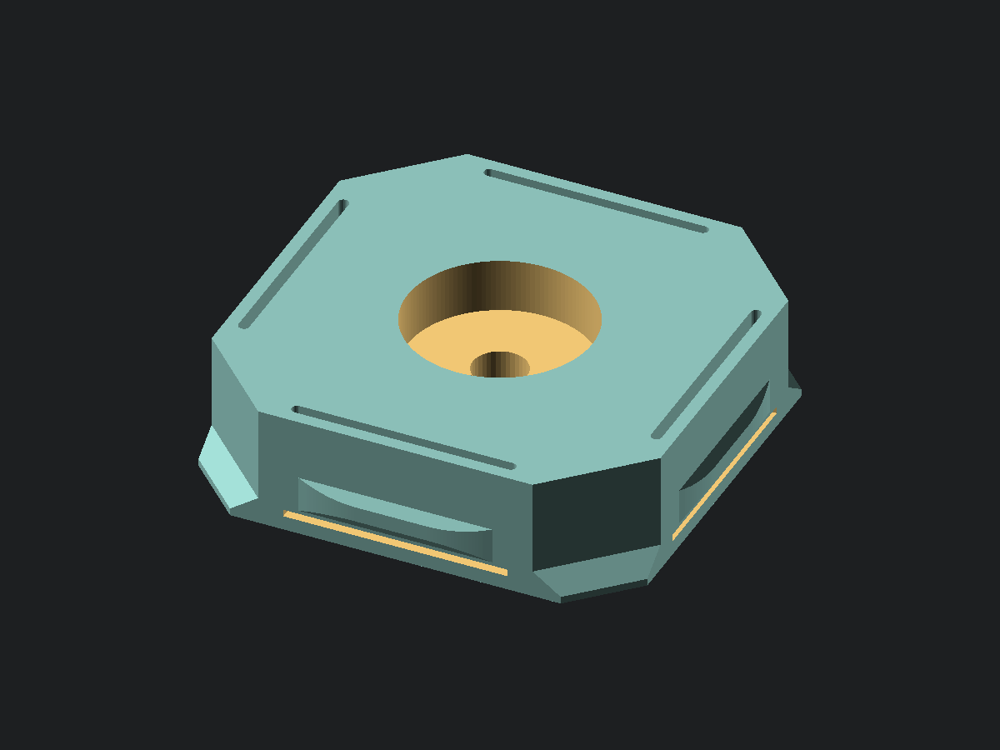
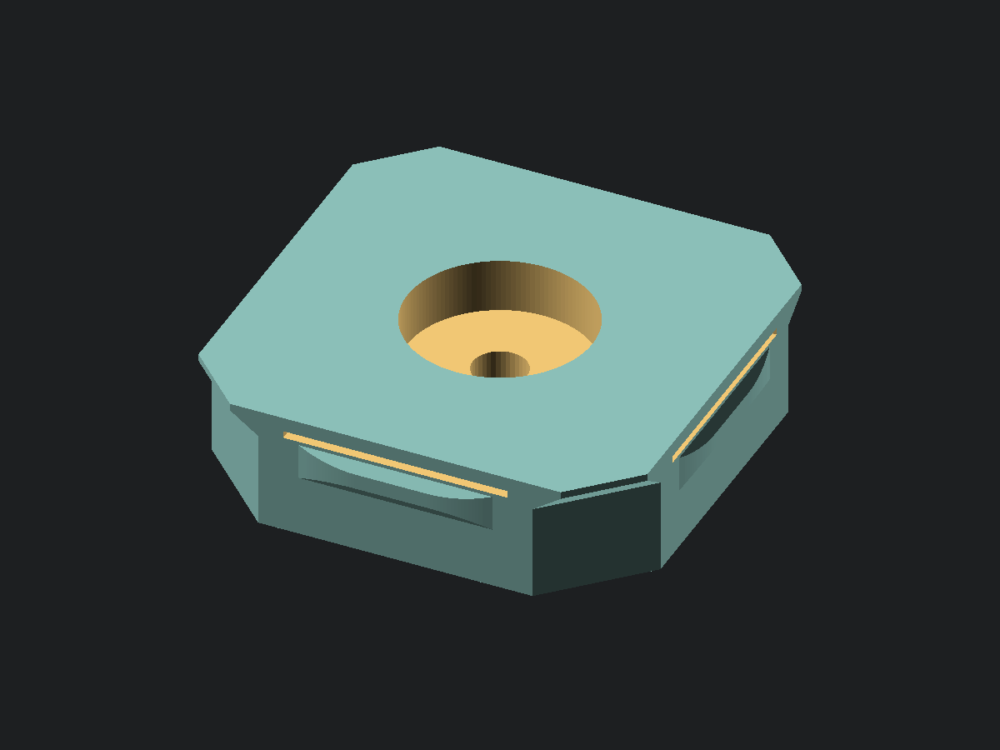

# openGrid magnet snaps

Two full-thickness openGrid snaps that carry a disc magnet instead of a
connector, differing only in which face the magnet is on. Drop one into any cell
of a regular 6.8 mm board, or either face of a 13.6 mm Heavy one, and that cell
becomes a magnetic pad, so the board hangs off steel with no fastener and no
adhesive.

They exist to hang an openGrid tile under the top plate of a steel speaker
stand, where the tile carries an Underware cable channel on its other face. The
cells not doing cable duty become magnets and the tile holds itself up.

**Which one you want:** the [back face](#back-face) snap is the one that sticks
a tile to steel, because its magnet ends up on the face the steel is against.
The [front face](#front-face) snap presents its magnet outward instead, to catch
something steel laid onto the tile. The back one also prints cleanly and the
front one does not, so where either would do, use the back.

System-level facts about openGrid — tile thicknesses, the snap profile
dimensions, the print-orientation rules, licensing, and the assumptions that
turned out to be wrong — live in [OPENGRID.md](../OPENGRID.md) rather than here,
since they outlive these two parts.

## Back face

[View or download STL](opengrid_magnet_snap_back.stl) · [OpenSCAD source](opengrid_magnet_snap_back.scad)

A full-thickness openGrid snap that carries a disc magnet instead of a
connector. Drop one into any cell of a regular 6.8 mm board, or either face of
a 13.6 mm Heavy one, and that cell becomes a magnetic pad, so the board hangs
off steel with no fastener and no adhesive.

It exists to hang an openGrid tile under the top plate of a steel speaker stand,
where the tile carries an Underware cable channel on its other face. The cells
not doing cable duty become magnets and the tile holds itself up.

The magnet is on the **back** — the narrow end of the shank, the end that runs
into the tile and comes to rest against whatever the tile is mounted on. That is
what makes this the variant that sticks a tile to steel. See
[OPENGRID.md](../OPENGRID.md#front-and-back-on-a-snap) for why front and back
mean the wide and narrow ends rather than anything about the tile.

**The through hole is optional and does three jobs.** It vents the bore, so
cyanoacrylate cannot hydraulic-lock against the magnet and push it back out
while it cures. It pushes a magnet out again if one has to come apart. And it
passes a fastener, so the magnet can be a bolted pot magnet rather than a plain
disc — though the hole comes out the opposite face from the bore, so a bolt head
lands there proud of a board the snap is flush in. Countersink it, or pick a
magnet that does not need a head on that side. Set `through_hole = false` when the magnet is going on with an adhesive
dot instead: a dot needs no vent, and the unbroken face is tidier. A dot holds
very little, but for a cable channel that is carrying nothing vertically it is
enough.

**Measuring.** Two measurements, both on the magnet:

| Parameter | Measure | Caliper |
| --- | --- | --- |
| `magnet_d` | Outside jaws across the disc | 6 in |
| `magnet_h` | Outside jaws on the plain edge of the disc | 6 in |

Plated magnets vary by a couple of tenths between nominally identical discs, so
measure the ones in your hand rather than trusting the listing.

**Deciding.** `magnet_fit` is the clearance added to the bore diameter. The
magnet wants to drop in rather than be pressed: a press fit on a brittle plated
disc chips the plating, and the chip is what breaks the bond a year later.
`magnet_recess` sets how far below the face the magnet sits — zero is flush,
which is what lets it touch the steel directly, and a negative value stands it
proud for a harder grip at the cost of the magnet taking the scuffing instead of
the snap. Oversized discs are asserted against the relief slots and against the
floor left under the bore, so a magnet too fat or too thick fails the render
rather than the print.

**The snap profile is not original work.** It is the openGrid standard snap,
reproduced from [mitufy's parametric snap
generator](https://github.com/mitufy/opengrid-projects) under CC BY 4.0, so that
these files can stand alone the way every source here does. The dimensions in
each file's openGrid interface block are that standard, not tuning knobs, and
changing one makes a snap that no longer fits a board. The reconstruction agrees
with the generator to 0.02% by volume — see
[OPENGRID.md](../OPENGRID.md#verifying-a-reimplementation) for the profile table
and the check that produced that number.

One thing departs from the standard, and it is hidden. The official snap's
relief groove has a flat roof, which is a 90° ceiling whichever way up the snap
is printed. Here it is a gable, the same trick the wall anchor's tie channel
uses. The change is entirely inboard of the face plane — the groove's mouth is
still 0.4 mm tall by 0.8 mm deep, so a board cannot tell the difference — and it
takes about 2 mm³ out of each arm root, in a pocket that exists to be empty.

**Printing.** PETG, PLA or ASA, no supports. Print as modelled, front face down
and bore facing up. This variant gets its orientation for free: the bore has to
open upward because a 10.2 mm circular ceiling is not something to bridge, and
the relief slots that free the four arms open out of the back face, so both want
the same way up. Nothing in the part is left hanging — worst overhang is 45° at
the groove gable, with the nub faces behind it at 35°. Four perimeters and 30%
infill or more, since the arms are what the snap fit lives in and they are thin.
The four ears are the only thing touching the plate at full width, so make sure
the first layer is properly squished or they will lift. Drop the magnet in after
printing, bore side up, and wick a little thin CA down the through hole from the
other side rather than puddling it in the bore.

## Front face

[View or download STL](opengrid_magnet_snap_front.stl) · [OpenSCAD source](opengrid_magnet_snap_front.scad)

The same snap with the magnet on the front instead — the wide end carrying the
ears, which stays on the side you pushed from and faces you. Reach for this one
when the magnet has to present outward, to catch something steel laid onto the
tile, rather than to hold the tile up. Everything above about magnets,
clearances, the through hole and the openGrid profile applies unchanged;
mirrored into the same orientation the two parts are geometrically identical,
which is checked the same way.

**This one pays for its orientation.** The bore still has to open upward, and
here the bore is on the front face, so the front goes up and the back goes on
the plate — the reverse of the back variant. That inverts the relief slots:
instead of opening out of the back face they run up from the plate and stop
0.6 mm short of the front face, leaving their closed ends as four flat roofs.

**Those roofs are left flat deliberately, and the build says so on every run.**
Each spans the slot's 0.6 mm width, not its 12.4 mm length — a gap no support
material could be placed in and no printer struggles to cross. Every way of
angling one is taken out of the 0.6 mm of material above the slot, and that
material is the root the arm hinges on: a 45° gable halves it to 0.3 mm, under a
single 0.42 mm perimeter, and a ramp across the slot consumes it outright and
opens a slit to the front face. The snap fit lives in that hinge and a 0.6 mm
bridge does not, so the hinge wins. It is one of two parts here that trip the
overhang check on purpose — the [sailor hat](../sailor_hat/README.md)'s letter
pockets are the other — and `scripts/build.py` will keep naming both.

**If either variant would do the job, print the back one.** It has no flat roof
anywhere.

**Printing.** As above, but back face down and bore facing up. Do not let the
slicer turn it over: that puts a 10.2 mm ceiling over the magnet bore, which is
a real bridge rather than the 0.6 mm ones this orientation accepts. Behind those
roofs it is 45° at the groove gable and 35° at the nub faces. First layer
adhesion is easier here than on the back variant, since the whole back face
lands on the plate rather than just four ears.
