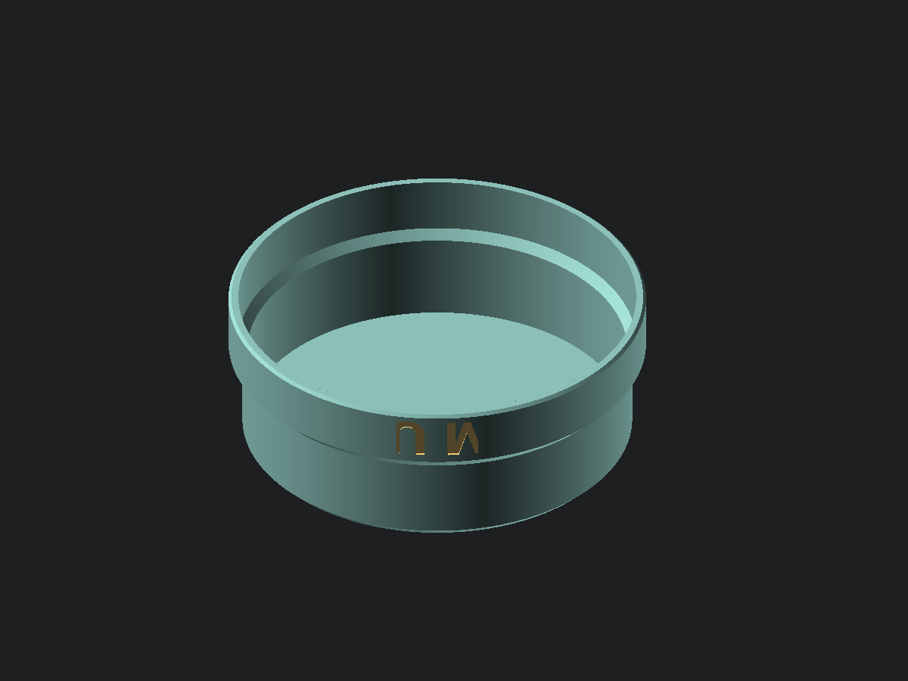

# Sailor hat

[View or download STL](sailor_hat.stl) · [OpenSCAD source](sailor_hat.scad)

A wearable US Navy Dixie cup — a shallow bucket with a turned-up brim, two
initials set into the band — as worn by a certain retro bear mascot. One printed
shell plus two letter tiles that drop into pockets cut for them, so the lettering
comes out a different colour without a filament swap, an AMS, or any purge waste.

The letters are a system with their pockets rather than parts in their own right.
They share every dimension that decides whether they seat, so they live in one
source and export as three bodies, the way the dogbone's halves do.

**The preview is upside down, and so is the model.** It is drawn in its print
orientation, flat top on the plate and mouth up, which is why the catalogue image
looks like a bowl and the lettering reads inverted. Worn, it is the right way up
and the initials read normally.

## Measuring

One measurement, and it is the one place in this repository that a caliper is the
wrong tool.

| Parameter | Measure | Instrument |
| --- | --- | --- |
| `head_circumference` | Around the head at its widest, just above the ears and across the brow, snug but not pulled in | Flexible tape |

A head is about 185 mm across, past a 12 in caliper, and there is nothing on a
head for jaws to close on anyway. Headwear has been sized by a tape around the
skull for as long as there has been headwear. The repository's caliper rule
exists so that a value which needed the wrong tool gets caught before it is
entered; here the right tool is simply not a caliper, and saying so is the point
rather than the exception. Diameter is still derived and never measured, exactly
as the rule intends.

Adult heads run about 540 to 620 mm. It ships at 580, a common middle. Everything
else follows from it: the crown is the head plus a wall, the brim is the crown
plus its stand-off, and the outside diameter is whatever those come to.

At the shipped size the hat is 209.6 mm across and 79 mm tall, which needs
221.6 mm of bed. That is asserted against `bed_size`, so a head too big for the
printer fails the render rather than the print.

## Deciding

`head_clearance` is the whole difference between a hat that drops on and one that
grips — it is a diameter, so half of it shows as gap on each side.

The brim is a hollow cuff, not a solid ring. Filled solid it was most of the
hat's weight and print time on its own: 388 cm³ against 242 cm³ hollow. Its wall
is thicker than the crown's because the letter pockets are cut into it, and
`letter_backing_min` asserts that what is left behind a pocket stays sensible.

`letter_fit` is applied to the pocket rather than the tile, so the letters stay
the size they were drawn and the hole grows instead. `letter_cap_height` is what
the lettering is centred and bounds-checked against; OpenSCAD's `size` is an
ascent rather than an em, so a capital lands near 0.95 of it in Liberation Sans
Bold. Change fonts and that ratio changes — measure a render and put the answer
back.

`letter_azimuth` only decides where the initials sit around the hat. The wearer
decides which way is front by how they put it on; the parameter exists to turn
them towards the catalogue preview's fixed camera.

## The lettering is mirrored, and has to be

Going from the modelled orientation to the worn one is a half turn about a
horizontal axis, which negates z and leaves x alone. A letter drawn upright in
the model would therefore read upside down on a head. The glyphs are mirrored in
y before extrusion to cancel it — mirrored rather than turned a half turn,
because a half turn would negate x too and leave the initials running backwards.

Letters and pockets both come through the one module that does this, so they
cannot disagree about which way up they are. Verified by rendering the hat in its
worn orientation and reading it.

## Overhangs

This part trips the overhang check, and the lettering is the whole reason. Two
features do it, both cantilevers standing off a pocket floor:

- The material above a letter reaches out over its pocket — a flat ceiling whose
  span is the pocket's depth, not the letter's width. The same overhang any screw
  hole through a vertical wall has.
- A letter with a closed counter leaves an island of wall standing inside it: the
  U's bowl, and O, D or P if you change the initials. That island's underside
  follows the inside of the glyph, so it sweeps from vertical round to horizontal
  at the bottom of the counter.

**Neither reaches further out than `letter_depth`.** Measured on the mesh, every
facet past 45° lies in a 1.96 mm band at the brim's outer surface, against a
2 mm pocket. Drafting them away would mean tapering the pocket along a letter
outline, which stops the inlay seating flush, and a flush inlay is the entire
point. Shallower pockets buy a shorter reach if it ever matters.

Everything else is 45° or better by construction: the top chamfer rises by its
own run, the brim flares out by exactly `brim_proud` while rising the same, and
the cuff's inner taper does likewise. No value of any of them turns one into an
overhang. The tiles, laid on their flat backs, are clean at 0.03°.

## Printing

PLA or PETG. Print as modelled, flat top down, and do not let the slicer turn it
over. Three walls, 10% infill, no supports.

The flat top is the first layer and it is a wide disc, so adhesion is easy; the
rim at the far end is the free edge and is where any warp will show. The two
letter tiles are small and slightly curved — about half a millimetre across their
width — so give them a brim. They are curved on the show face and flat on the
back, which is both what lets them sit flush in a round brim and what gives them
a face to print on.

Letters go in after printing. The pocket is cut `letter_fit` larger all round, so
they should drop in and want a dab of glue rather than a press. The tiles were
checked against their pockets by boolean difference: nothing of either tile lies
outside its pocket, and the clearance shell between them comes to 73.9 mm³.

This is a costume piece, not PPE. It is a rigid shell and it will crack rather
than deform if it is sat on.

## A note on the initials

`letter_left` and `letter_right` are parameters and the part is a generic Dixie
cup, but the shipped defaults spell out a real university's initials on a real
mascot's hat. Marks are a trademark question rather than a copyright one, and the
licence on this repository has nothing to say about it. Printing one for yourself
is not the concern; selling them, or publishing it somewhere that reads as
official merchandise, is where it would become one.
